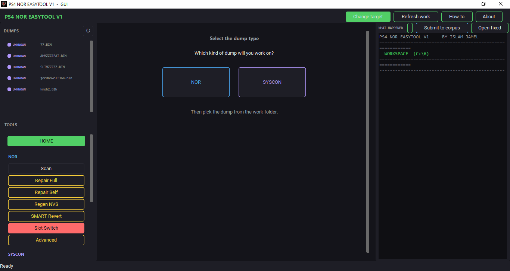
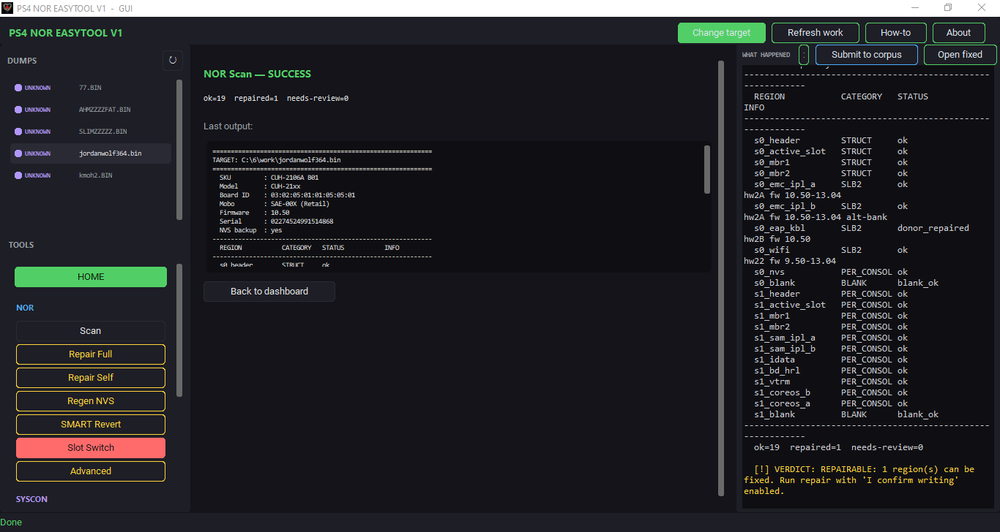
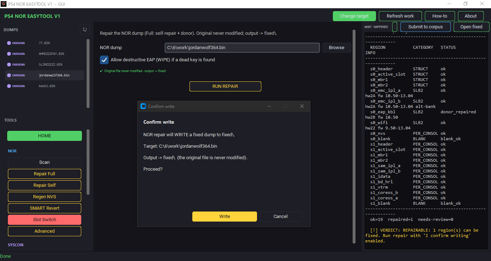
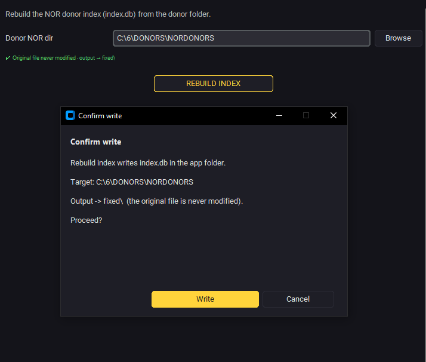
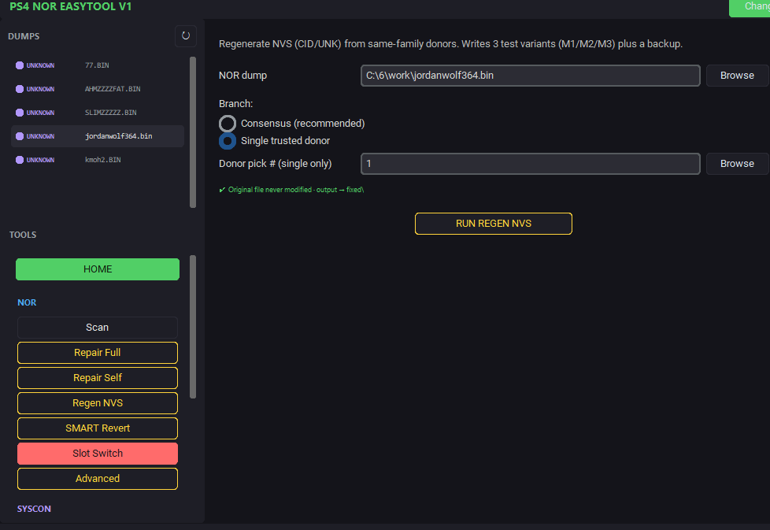
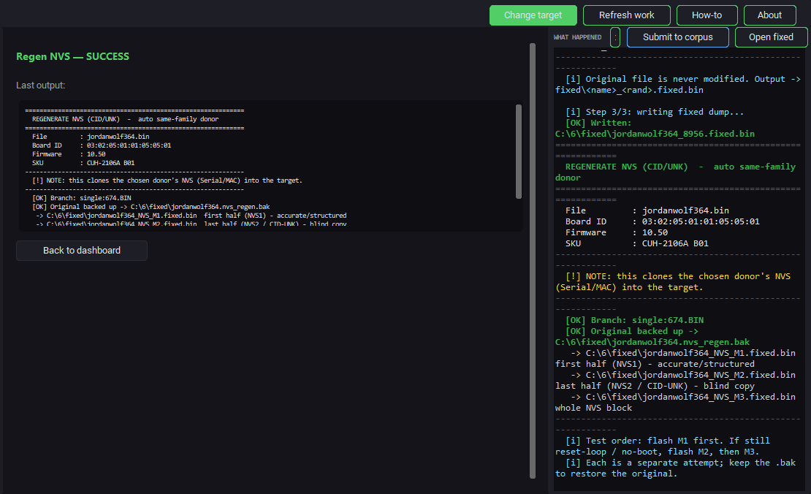
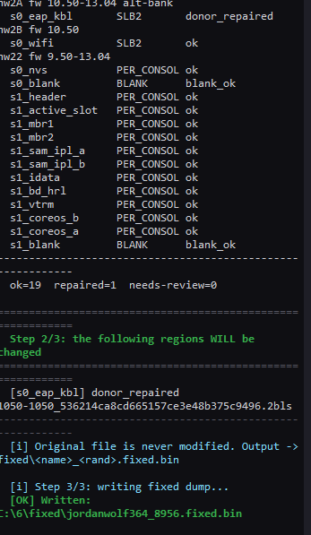
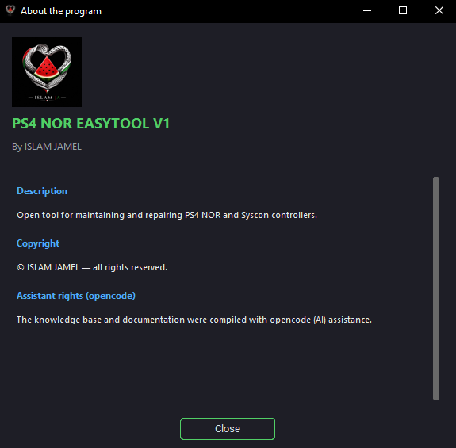

<p align="center">
  
</p>

<h1 align="center">PS4 NOR &amp; Syscon — Open Repair Knowledge Base</h1>

<p align="center">
  <b>An open, community-driven knowledge base for repairing PS4 NOR and Syscon dumps,</b><br/>
  paired with the <b>PS4 NOR EASYTOOL V1</b> companion application by ISLAM JAMEL.
</p>

<p align="center">
  <a href="LICENSE"></a>
  <a href="docs/en"></a>
  <a href="community/corpus"></a>
  <a href="https://github.com/ISLAMGAZA"></a>
  <a href="https://paypal.me/islamjamelak"></a>
</p>

---

## English

### What is this?
> **Status:** A personal effort (تعب شخصي) — still under active development (قيد التطوير).

A free, open project that turns the knowledge embedded in **PS4 NOR EASYTOOL V1**
into a **shared, searchable repair knowledge base** for the PS4 maintenance
community. It documents NOR / Syscon regions, faults, downgrade paths, and field
procedures — and lets every technician **contribute anonymized real-world dumps**
so the whole community learns which faults appear on which console models and
firmware versions.

### Key features
- **Machine-readable knowledge base** (`kb.json`): 22 NOR regions, 3 Syscon
  regions, 14 NVS fields, 20 fault types, 8 operations, 14 quick facts.
- **Bilingual documentation** (`docs/en` + `docs/ar`) with an in-browser
  `docs/index.html` that toggles between English and Arabic.
- **Open repair corpus**: technicians submit anonymized health reports; the
  community aggregates them into `community/stats.json` (no serial / MAC / HDD /
  board-id is ever stored).
- **PS4 NOR EASYTOOL V1 companion app** (Windows, by ISLAM JAMEL): scans,
  repairs, regenerates NVS, SMART revert, slot switch, and more — with an
  in-app **"Submit to corpus"** button that pushes an anonymized report straight
  to this repository.

### Download & install
1. Go to **Releases** and download `PS4_NOR_EASYTOOL_V1_GUI.exe`
   (graphical) and/or `PS4_NOR_EASYTOOL_V1.exe` (console).
2. Place the `.exe` where you like; it auto-creates `DONORS\`, `work\`, and
   `fixed\` next to it.
3. For repair operations, rebuild the donor indexes once from the app
   (NOR ▸ Advanced / Syscon ▸ Advanced).

### Quick start
- Launch the GUI → pick a dump from **DUMPS** (or *Change target*) → choose
  **NOR** or **Syscon** → select the file from `work\`.
- Run **Scan** first to see the region report, then apply a repair.
- Use **About** for credits/links, **How-to** for a 9-step guide, and the
  **ع/EN** language switch (UI ships English; see note below).
- Click **Submit to corpus** to anonymously share the health report with the
  community (requires `gh` CLI authenticated to a GitHub account).

### The Open Repair Corpus
Reports are generated by `main.export_report()` and contain **only**
model / sku / firmware / subsystem / health status / faulty regions — every
identifier that could leak a console's identity is stripped. Submitted reports
land in `community/corpus/` and are aggregated into `community/stats.json` by a
GitHub Action on every pull request.

### Repository structure
```
ps4-nor-syscon-kb/
├── README.md                 # this file
├── LICENSE                   # MIT (code/scripts) + CC-BY-4.0 (docs)
├── CREDITS.md                # authorship & rights
├── branding/                 # app icon (watermelon)
├── kb.json                   # the knowledge base (generated)
├── docs/                     # en/ + ar/ + index.html
├── community/
│   ├── SCHEMA.md             # report schema
│   ├── CONTRIBUTING.md       # how to contribute
│   ├── config.json           # GitHub target (owner/repo/branch)
│   ├── corpus/               # anonymized submitted reports
│   └── stats.json            # aggregated statistics
├── scripts/
│   ├── gen_kb.py             # code -> kb.json
│   ├── gen_docs.py           # kb.json -> docs
│   └── aggregate.py          # corpus -> stats.json
└── .github/                  # templates, SECURITY, workflows
```

### Contributing
- **From the app**: *Submit to corpus* (anonymized, no secrets).
- **Manual**: add a JSON report to `community/corpus/` or open a Pull Request
  (see `community/CONTRIBUTING.md` and `community/SCHEMA.md`).
- **Ideas & questions**: open an Issue or use Discussions.

### Credits & rights
- **Tool & data**: ISLAM JAMEL — [github.com/ISLAMGAZA](https://github.com/ISLAMGAZA).
- **Knowledge base & documentation**: compiled with **opencode** (AI)
  assistance, building on ISLAM JAMEL's tool and domain data.
- **License**: code and scripts under **MIT**; documentation under **CC-BY-4.0**.
- **Donate**: [paypal.me/islamjamelak](https://paypal.me/islamjamelak).

### Screenshots
A look at the tool and knowledge base in action:

| | |
|---|---|
|  |  |
|  |  |
|  |  |
|  |  |

---

## العربية

### ما هذا المشروع؟
> **الحالة:** جهد شخصي (تعب شخصي) — لا يزال قيد التطوير النشط (قيد التطوير).

مشروع مفتوح ومجاني يحوّل المعرفة المضمّنة في أداة **PS4 NOR EASYTOOL V1** إلى
**قاعدة معرفة مشتركة قابلة للبحث** لصيانة متحكمات PS4 NOR و Syscon، مصحوباً
بالتطبيق الرفيق **PS4 NOR EASYTOOL V1** من إعداد **ISLAM JAMEL**.

### المميزات الأساسية
- **قاعدة معرفة قابلة للقراءة آلياً** (`kb.json`): 22 منطقة NOR، 3 مناطق
  Syscon، 14 حقل NVS، 20 نوع عطل، 8 عمليات، 14 معلومة سريعة.
- **توثيق ثنائي اللغة** (`docs/en` + `docs/ar`) مع `docs/index.html` يتبدّل
  بين الإنجليزية والعربية داخل المتصفح.
- **مستودع إصلاح مفتوح**: يرسل الفنيّون تقارير صحّية مُجهّلة، وتُجمَّع في
  `community/stats.json` (دون حفظ السيريال/MAC/القرص/معرّف اللوحة أبداً).
- **تطبيق PS4 NOR EASYTOOL V1 الرفيق** (ويندوز، لـ ISLAM JAMEL): فحص وإصلاح
  وإعادة توليد NVS وتراجع SMART وتبديل الشريحة وغيرها — مع زر **«Submit to
  corpus»** داخل التطبيق يرفع تقريراً مُجهّلاً إلى هذا المستودع مباشرة.

### التحميل والتثبيت
1. افتح **Releases** وحمّل `PS4_NOR_EASYTOOL_V1_GUI.exe` (رسومي) و/أو
   `PS4_NOR_EASYTOOL_V1.exe` (سطر أوامر).
2. ضع الملف التنفيذي حيث شئت؛ سيُنشئ تلقائياً `DONORS\` و`work\` و`fixed\`.
3. لعمليات الإصلاح، أعد بناء فهارس المتبرِّعين مرة واحدة من التطبيق
   (NOR ▸ متقدم / Syscon ▸ متقدم).

### البداية السريعة
- شغّل الواجهة ← اختر تفريغاً من **DUMPS** (أو «Change target») ← اختر **NOR**
  أو **Syscon** ← حدّد الملف من `work\`.
- شغّل **Scan** أولاً لرؤية تقرير المناطق، ثم طبّق الإصلاح.
- استخدم **About** للحقوق والروابط، و**How-to** لدليل من 9 خطوات.
- اضغط **Submit to corpus** لمشاركة التقرير الصحي مع المجتمع (يتطلب أداة `gh`
  مُصرّحة بحساب GitHub).

### مستودع الإصلاح المفتوح
تُولّد التقارير عبر `main.export_report()` ولا تحتوي سوى الموديل/SKU/الفيرموير/
النظام الفرعي/حالة الصحة/المناطق المعطوبة — مع حذف أي مُعرّف قد يكشف هوية الجهاز.
تُودَع التقارير في `community/corpus/` وتُجمَّع في `community/stats.json`
عبر GitHub Action عند كل طلب سحب.

### المساهمة
- **من التطبيق**: زر «Submit to corpus» (مُجهّل، بلا أسرار).
- **يدوياً**: أضف تقرير JSON إلى `community/corpus/` أو افتح Pull Request
  (انظر `community/CONTRIBUTING.md` و`community/SCHEMA.md`).
- **الأفكار والأسئلة**: افتح Issue أو استخدم Discussions.

### الحقوق والإسناد
- **الأداة والبيانات**: ISLAM JAMEL — [github.com/ISLAMGAZA](https://github.com/ISLAMGAZA).
- **قاعدة المعرفة والتوثيق**: صِيغت بمساعدة **opencode** (الذكاء الاصطناعي)
  بالاستناد إلى أداة وبيانات ISLAM JAMEL.
- **الرخصة**: الكود والسكربتات تحت **MIT**؛ التوثيق تحت **CC-BY-4.0**.
- **تبرع**: [paypal.me/islamjamelak](https://paypal.me/islamjamelak).

### لقطات الشاشة
لمحة عن الأداة وقاعدة المعرفة أثناء العمل:

| | |
|---|---|
|  |  |
|  |  |
|  |  |
|  |  |

---

## A note from the assistant · بصمة

> Assembled with **opencode** — for the hands that repair, not the bins that
> fill. Every console brought back to life is a small victory; this project
> only helps map the way.
>
> صِيغَتْ بـ **opencode** — لأجل الأيادي التي تُصلح، لا للحاويات التي تمتلئ.
> كل جهاز يُعاد إحياؤه نصرٌ صغير، وهذا المشروع لا يرسم سوى الطريق.

**Tool & data:** ISLAM JAMEL · [github.com/ISLAMGAZA](https://github.com/ISLAMGAZA)  
**Support the work:** [paypal.me/islamjamelak](https://paypal.me/islamjamelak)
